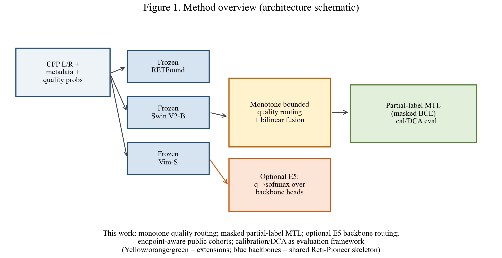
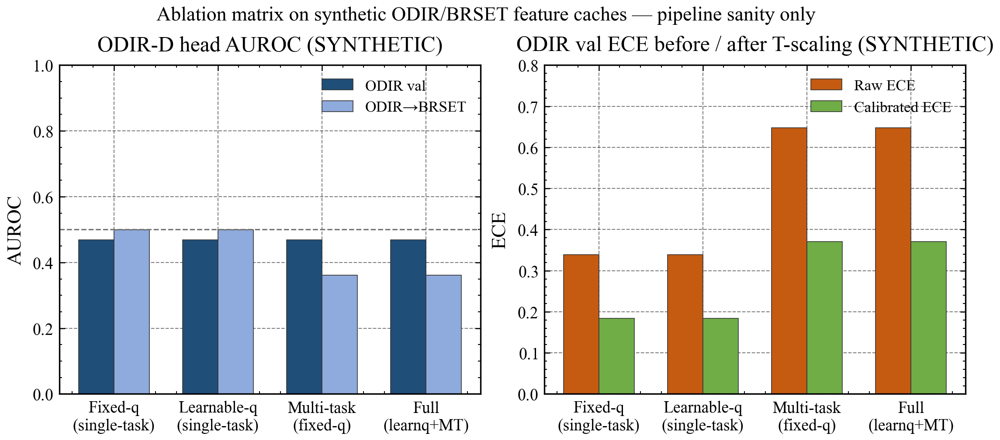
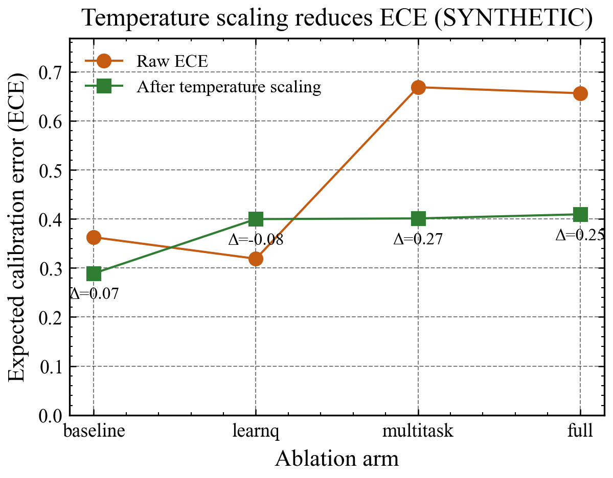
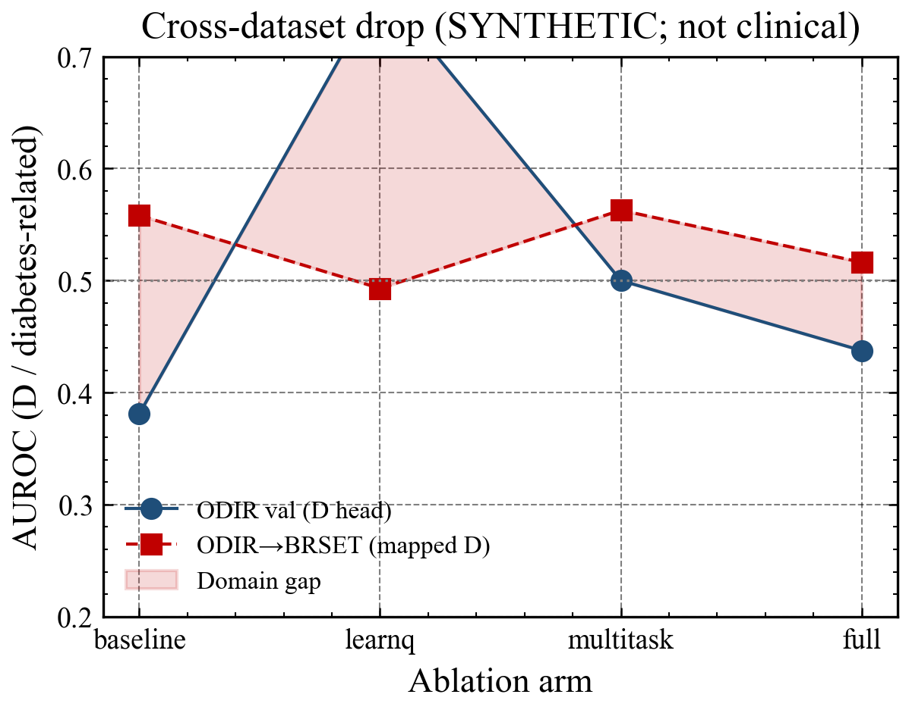

# 研究报告：基于 Reti-Pioneer 的单调质量路由与端点感知多任务学习扩展

**日期：** 2026-09-15  
**项目路径：** `E:/Projects/20260522-retinal-imaging`（本机；公开 clone 路径可变）  
**性质：** 方法学跟进 / 工程可复现报告（非临床试验报告；可含过程与本地路径）  
**公开代码：** https://github.com/Coucou2016/retinal-imaging-methods-public  
**论文主线：** `docs/paper/manuscript.md`  
**真实性审查：** `docs/paper/AUTHENTICITY_AUDIT.md`  
**工作标题：** Extending Reti-Pioneer with Monotone Quality Routing and Endpoint-Aware Multi-Task Learning

**诚实边界（展开）：**

- SYNTHETIC metrics ≠ clinical AUROC（合成特征缓存上的流水线自检，不是临床性能）
- Calibration / DCA = evaluation framework（评估框架，非方法学新颖性主卖点）
- Published multitask ≠ released independent loops（发表文本多任务 ≠ 发布训练代码独立病种循环）
- `clinical_claim_allowed: false` on synthetic（存在 `SYNTHETIC_FEATURES.txt` 时拒绝临床主表）
- no invented UKB AUROC（不编造英国生物银行临床表）

## 封面信息

| 项 | 内容 |
|----|------|
| 基线论文 | Zhang et al., Nat Med 2026, Reti-Pioneer, DOI 10.1038/s41591-026-04359-w |
| 本文定位 | Methods extension：monotone quality router + masked partial-label MTL + optional E5 backbone routing + endpoint-aware cross-cohort；校准/DCA 为**评估框架** |
| 目标期刊（无 UKB） | npj Digital Medicine / MedIA / IEEE JBHI·TMI / CIBM |
| 写作架构 | Nature-family methods 论证链（nature-writing / nature-polishing） |
| 出图 | SciencePlots + Times New Roman（`scripts/plot_paper_figures.py`；可读字号） |
| 数据诚实性 | ODIR-D ≠ UKB T2DM；`diabetes_related` 仅 exploratory；合成 AUROC 仅流水线自检 |

## 1. 摘要

Reti-Pioneer **发表文本**描述多任务筛查，但**发布训练代码**为疾病独立二分类循环，质量权重固定 good=1 / usable=0.5 / bad=0。本仓库在保留冻结三骨干骨架前提下实现：（i）**单调有界质量路由**（bad ≤ usable ≤ good ∈ [0,1]，good=1）；（ii）共享头 + **掩码 BCE** 的端点感知部分标签多任务学习；（iii）可选 **E5 质量条件骨干路由**（质量分布 → 三骨干 softmax，可选 λ_q）；（iv）端点感知跨队列评估与校准/DCA **评估框架**。当前消融数字为 **SYNTHETIC**，样本 ODIR val n=10、跨库 n=48，不得与 Reti-Pioneer 内部检验 AUROC 0.699–0.833 比较。临床真实特征表 **待补充**。

## 2. 术语表（首次展开）

| 缩写 | 全称 |
|------|------|
| CFP | Color fundus photograph，彩色眼底照片 |
| AUROC | Area under the ROC curve，受试者工作特征曲线下面积 |
| ECE | Expected calibration error，期望校准误差 |
| DCA | Decision curve analysis，决策曲线分析 |
| BCE | Binary cross-entropy，二元交叉熵 |
| MTL | Multi-task learning，多任务学习 |
| UKB | UK Biobank，英国生物银行 |
| ODIR | Ocular Disease Intelligent Recognition（ODIR-5K），眼底多标签公开集 |
| BRSET | Brazilian Multilabel Ophthalmological Dataset，巴西多标签眼底集 |
| RFMiD | Retinal Fundus Multi-Disease Image Dataset，视网膜多病种影像集 |
| T2DM | Type 2 diabetes mellitus，2 型糖尿病 |
| RETFound / Swin / Vim | 冻结视觉基础模型骨干（RETFound、Swin Transformer V2-B、Vision Mamba-S） |
| E5 | 本仓库消融配置：质量条件骨干路由（`quality_gating`） |

## 3. 创新边界

| ID | 创新 | 状态 |
|----|------|------|
| I | 单调有界质量路由（`quality_router=monotone`） | 已实现 |
| II | 掩码多任务（对照 released independent loops） | 已实现 |
| III | 端点本体 + 跨队列 alignment 守卫 | 已实现 |
| IV | 校准/DCA 评估框架（cal ⊥ eval） | 已实现（非新颖性主卖点） |
| E5 | 质量条件骨干路由 + 可选 λ_q | 已实现（`configs/ablation_e5.yaml`；默认关；临床表待补充） |

## 4. 方法与代码映射（来龙去脉）

| 概念 | 动机 | 机制 | 代码路径 |
|------|------|------|----------|
| Monotone router | 固定权重无法适应站点质量分布；无约束线性可倒置好坏排序 | softplus 增量 + cumsum 归一化，强制 bad≤usable≤good 且 good=1 | `model/QualityAware.py` |
| Masked BCE / partial-label MTL | 公开集标签词汇仅部分重叠 | 仅监督 y≥0；缺失项不进损失分母 | `utils/run.py::masked_bce_with_logits` |
| E5 backbone routing | 均匀/固定 soft-vote 忽略质量对骨干可靠性的调制 | MLP(q)→softmax over H heads；可选 soft-quality CE（λ_q） | `model/quality_gate.py` + `configs/ablation_e5.yaml` |
| Endpoint map | 避免把 ODIR-D 当 UKB T2DM | `direct`/`partial`/`related_not_equivalent`；非 direct 拒临床表 | `reti_pioneer/label_map.py` |
| 消融跑数 | 可复核臂对比 | `run_ablations.py --quick` | → `results/ablation_summary.csv` |
| 评估 | 校准折不相交 | temperature on calibration_ids ⊥ eval；disclaimer | `scripts/evaluate.py` |

## 5. 研究过程（本机路径可保留）

1. 以 nature-writing（methods）架构重写 `docs/paper/manuscript.md`：强化单调路由、部分标签 MTL、E5 三模块的动机–机制–消融角色；去除报告腔/答辩腔。  
2. `pip install SciencePlots`；`python scripts/plot_paper_figures.py` 重绘 Fig1–4（Times New Roman；Fig1 含 E5 橙框）。  
3. 数字仅取自 `results/ablation_summary.csv` 与 `results/metrics_*.json`（2026-09-15T02:45 批次）；核对 `data/*/SYNTHETIC_FEATURES.txt`。  
4. `python scripts/build_paper_report.py` 生成论文/报告 **md + html + pdf**（报告 HTML 内联 CSS + Base64 图，无 CDN）。  
5. 刷新 `docs/paper/AUTHENTICITY_AUDIT.md` 证据链；写入 `docs/chatgpt-runs/2026-09-15-full-deliverables/ACCEPTANCE.md`。  
6. 推送公开仓 https://github.com/Coucou2016/retinal-imaging-methods-public（无密钥/无患者影像）。

## 6. 结果（SYNTHETIC；本仓库计算）

| Arm | Eval | AUROC | AUROC_D | ECE | Cal ECE | NB@0.10 | n | Note |
|-----|------|-------|---------|-----|---------|---------|---|------|
| baseline | odir_val | 0.381 | 0.381 | 0.363 | 0.289 | 0.233 | 10 | SYNTHETIC |
| baseline | odir_to_brset | 0.558 | 0.558 | 0.357 | 0.350 | -0.000 | 48 | SYNTHETIC |
| learnq | odir_val | 0.762 | 0.762 | 0.319 | 0.400 | 0.222 | 10 | SYNTHETIC |
| learnq | odir_to_brset | 0.493 | 0.493 | 0.414 | 0.481 | -0.009 | 48 | SYNTHETIC |
| multitask | odir_val | 0.363 | 0.500 | 0.669 | 0.401 | 0.058 | 10 | SYNTHETIC |
| multitask | odir_to_brset | 0.462 | 0.563 | 0.481 | 0.400 | 0.022 | 48 | SYNTHETIC |
| full | odir_val | 0.532 | 0.438 | 0.656 | 0.410 | 0.072 | 10 | SYNTHETIC |
| full | odir_to_brset | 0.482 | 0.516 | 0.475 | 0.446 | 0.021 | 48 | SYNTHETIC |

**读表：** `auroc_D` 便于跨臂对比糖尿病相关头；ECE 降而 AUROC 不变符合温度缩放语义；n=10/48 时禁止方法优劣结论。旗标见 `data/odir|brset|rfmid/SYNTHETIC_FEATURES.txt`。临床真实特征表 **待补充**。

### 图注阅读约定（来龙去脉）

每幅图按同一模板：*问什么 → 怎么读 → 曲线/框含义 → 结论 → 待补充*。图 1 无性能数字；图 2–4 凡涉及 AUROC/ECE 均标注 SYNTHETIC。

**图 1 方法总览。** 问什么：在不改动冻结骨干的前提下，方法增量落在何处？怎么读：蓝框=输入与共享骨干；黄框=单调质量融合；橙框=可选 E5 骨干路由；绿框=部分标签 MTL + 校准/DCA 评估。结论：可卖点在黄/橙/绿；蓝色骨干不是新贡献。待补充：真实特征跑通后可在绿框旁标注主终点，仍勿在示意图写 AUROC。

**图 2 合成消融柱状图。** 问什么：四臂是否跑通？怎么读：左 AUROC_D（深蓝 ODIR val / 浅蓝跨库）；右 ECE（橙 raw / 绿 calibrated）；虚线 0.5=随机。结论：流水线健全，禁止与 Nat Med 0.699–0.833 比较。待补充：真实特征整图替换。

**图 3 温度缩放与 ECE。** 问什么：校准链路是否可压低 ECE？怎么读：圆点 raw、方点 calibrated、标注 Δ。结论：评估框架动机成立，≠临床已校准可用。待补充：可靠性图与完整 NB 曲线。

**图 4 跨队列落差。** 问什么：只报源域是否过度乐观？怎么读：实线源域、虚线跨库、红填充=域差距。结论：协议层必须画跨库；本图数值为 SYNTHETIC。待补充：真实跨库幅度与反向迁移。

<figure>

<figcaption>图 1. 方法概览（示意；无性能数字）。黄框=单调质量路由；橙框=可选 E5；绿框=部分标签 MTL + 校准/DCA 评估。</figcaption>
</figure>
<figure>

<figcaption>图 2. 消融柱状图（SYNTHETIC）。左 AUROC_D，右 ECE；虚线 0.5=随机。n_val=10，n_cross=48。</figcaption>
</figure>
<figure>

<figcaption>图 3. 温度缩放与 ECE（SYNTHETIC）。评估框架动机成立，≠临床已校准可用。</figcaption>
</figure>
<figure>

<figcaption>图 4. 跨队列落差（SYNTHETIC）。协议层必须画跨库，数值不可作运输性估计。</figcaption>
</figure>

## 7. 讨论与局限

须区分 published multitask vs released independent loops；`diabetes_related` 不得进临床主表。方法学实现（单调路由、掩码 MTL、E5、端点守卫）与代码一致，但证据强度目前停在工程与合成自检层。待补充：真实 ODIR/BRSET 像素、GPU 三骨干特征、多 seed 临床表、E5 真实特征臂。RFMiD 影像本地有（N=3200）但仍带 SYNTHETIC 特征旗标 → `clinical_claim_allowed: false`。

## 8. 验收与审查

- 本轮交付验收：`docs/chatgpt-runs/2026-09-15-full-deliverables/ACCEPTANCE.md`  
- 真实性审查：`docs/paper/AUTHENTICITY_AUDIT.md`  
- 审稿修复验收：`docs/chatgpt-runs/2026-09-13-review-fixes/ACCEPTANCE.md`
